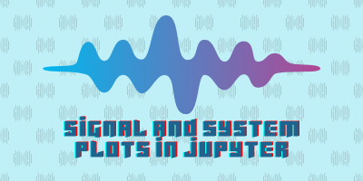

# Signal and System Dr. Ghasemian plots with Jupyter



This project contains Jupyter notebooks for plotting various signals commonly used in signal processing and universities courses.

## Usage ⚙️

- Each Jupyter notebook in this project corresponds to a specific type of signal. You can open and run these notebooks to generate plots for different signals.
- I wrote my codes in [VsCode](https://code.visualstudio.com/) so I recommend you to open Jupyter files with it too.
- I did not wrote plt.show(), so you can add it in last line of all Jupyter files if needed!
- Please before run Jupyter codes, with pip install numpy and matplotlib in your terminal:

  ```bash
  pip install numpy
  pip install matplotlib
  ```

## Contributing 👍

Contributions are welcome! If you find any issues or have suggestions for improvement, please open an issue or submit a pull request.

## Credits 🧑‍🏫📚

- Some signal snippets were adapted from the book "Signals and Systems by Oppenheim and Willsky"
- All plot codes was inspired by the examples in the matplotlib documentation in Dr.Ghasemian powerpoint.
